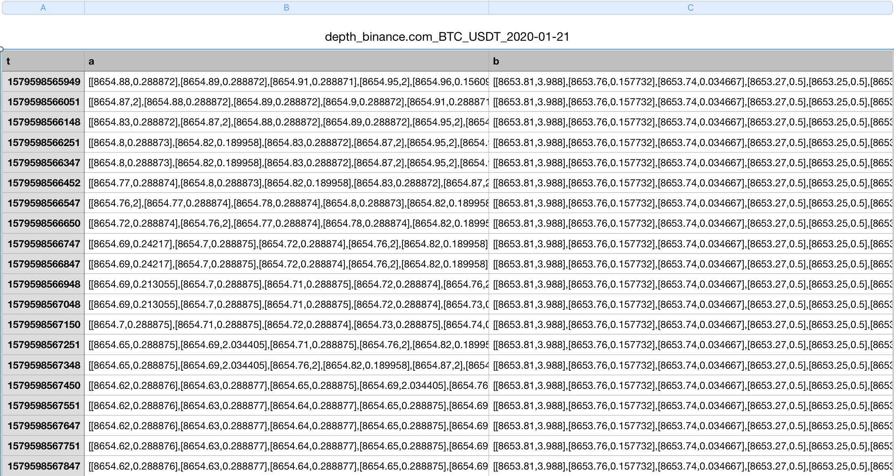

# Market Data Collector
 
[](https://travis-ci.org/goex-top/market_data_collector)


Collect market data for quant analysis
## Quick Start
### Installation

`go install github.com/goex-top/market_data_collector`

### Configure
create a configure file `config.json` , or `config.yml`, ( `cp config-sample.json config.json` or `cp config-sample.yml config.yml` )
```json
{
  "subs": [
    {
      "exchange_name": "binance.com",
      "currency_pair": "BTC_USDT",
      "period": 100,
      "flag": 3
    },
    {
      "exchange_name": "binance.com_swap",
      "currency_pair": "BTC_USDT",
      "contract_type": "swap",
      "period": 100,
      "flag": 3
    }
  ],
  "store": {
    "csv": false,
    "influx_db": true,
    "influx_db_cfg": {
      "url": "http://localhost:8086",
      "database": "market_data"
    }
  },
  "with_market_center": false,
  "market_center_path": "/tmp/goex.market.center"
}
```

```yaml
---
subs:
  - exchange_name: binance.com
    currency_pair: BTC_USDT
    period: 100
    flag: 2
  - exchange_name: okex.com_swap
    currency_pair: BTC_USDT
    contract_type: quarter
    period: 100
    flag: 2
with_market_center: true
store:
  csv: false
  influx_db: true
  influx_db_cfg:
    url: http://localhost:8086
    database: market_data
    username: 
    password:
market_center_path: "/tmp/goex.market.center"
```

**Description**

```
{
  "subs": [                                 // subscribs, it's a array for multi-exchanges
    {
      "exchange_name": "binance.com_swap",  // exchange name, ref to https://github.com/goex-top/market_center#support-exchanges
      "currency_pair": "BTC_USDT",          // pair with `_`
      "period": 100,                        // period
      "flag": 2,                            // flag, is a mask for market, 1: depth, 2: ticker, 3: depth and ticker
    }
  ],
  "store": {                                // storage
    "csv": true                             // store data to csv
    "influx_db": true,                      // store data to influxdb
    "influx_db_cfg": {
      "url": "http://localhost:8086",       // influxdb url
      "database": "market_data"             // influxdb database name
    }
  },
  "with_market_center: true                 // market data from exchange or not, if true, it will get market data from market center
  "market_center_path": "/tmp/goex.market.center"   // market center path
}

```

## Flag
only one command flag `-c` to input configure file, for example `market_data_collector -c config.json`


### Run
`market_data_collector -c config.json`

## Storage
### CSV
Store daily data in different `csv` files in `csv` folder, compress it to `tar` folder

`csv` folder(older file was removed automatically)
```
├── depth_binance.com_BTC_USDT_2020-01-26.csv
├── depth_fcoin.com_BTC_USDT_2020-01-26.csv
├── depth_huobi.pro_BTC_USDT_2020-01-26.csv
└── depth_okex.com_BTC_USDT_2020-01-26.csv
```

`tar` folder
```
.
├── binance.com_BTC_USDT_2020-01-24.tar.gz
├── binance.com_BTC_USDT_2020-01-25.tar.gz
├── fcoin.com_BTC_USDT_2020-01-24.tar.gz
├── fcoin.com_BTC_USDT_2020-01-25.tar.gz
├── huobi.pro_BTC_USDT_2020-01-24.tar.gz
├── huobi.pro_BTC_USDT_2020-01-25.tar.gz
├── okex.com_BTC_USDT_2020-01-24.tar.gz
└── okex.com_BTC_USDT_2020-01-25.tar.gz
```

#### Format
##### ticker


|  symbol | type | description |
|  ----  | ----  | ----  |
| t  | int | timestamp |
| b  | float | best bid |
| s  | float | best ask |
| h  | float | high price |
| l  | float | low price |
| v  | float | volume |

##### orderbook


|  symbol | type | description |
|  ----  | ----  | ----  |
| t  | int | timestamp |
| a  | array | asks list with size 20, each element is [p,q], p:price, q:qty |
| b  | array | bids list with size 20, each element is [p,q], p:price, q:qty |

### InfluxDB

influxDB schema

|MEASUREMENT | TAGS | FIELDS|
|  ----  | ----  | ----  |
|exchangeName_ticker  | spot=pair    | xxx|
|exchangeName_kline  | future_contractType=pair  | xxx|
|exchangeName_depth  | swap=pair    | xxx |

Measurement: Data Feed-Exxhange (configurable)
TAGS: pair
FIELDS: timestamp, amount, price, other funding specific fields

## Support Data
* Ticker 
* Depth(Orderbook)
* ~~Kline~~

## TODO
* SQLite


